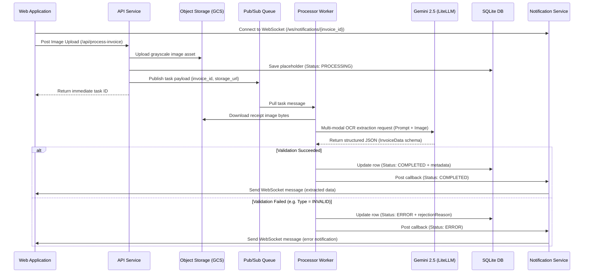

# Backend Solution Design

A robust, microservice-based backend system for digital receipt processing, storage, and retrieval, leveraging Gemini AI models for receipt recognition and structured data extraction.

---

## 1. System Architecture & Flow

The system is split into three decoupled services: the **API Service**, the **Processor Service (Worker)**, and the **Notification Service**. Communication occurs asynchronously via messaging queues (GCP Pub/Sub) and real-time WebSockets.

---

## 2. Key Components

### A. API Service (FastAPI)
* **Image Saving**: Uploads base64/binary image assets directly to Object Storage.
* **Orchestration**: Creates a pending database record, publishes a task message, and returns an immediate ID without blocking the web client.
* **REST CRUD**: Exposes endpoints for searching, displaying, saving modifications, and deleting invoices.

### B. Processor Service (Worker Daemon)
* **Message Polling**: Continuously listens to the queue subscription.
* **AI Receipt Recognition**: Downloads the image and sends it to Gemini via **LiteLLM** along with extraction prompts and guidelines.
* **Validation Engine**: Enforces that the document is a valid credit note/refundable receipt. Rejects invalid documents (standard purchase receipts, missing totals).
* **DB persistence**: Writes successfully parsed metadata directly into the database.

### C. Notification Service (WebSockets)
* **WebSocket Server**: Manages connection pools indexed by `invoice_id`.
* **State Updates**: Broadcasts a callback payload to the client immediately when a worker finishes analyzing the document.

---

## 3. Technology Stack

| Layer | Technology | Details |
| :--- | :--- | :--- |
| **Framework** | FastAPI (Python) | High-performance asynchronous API framework |
| **Cognitive OCR** | Gemini 2.5 Flash / LiteLLM | Advanced multimodal vision model returning structured Pydantic schemas |
| **Database** | SQLite | Serverless database (supports standard structured document tables) |
| **Object Storage** | Google Cloud Storage (GCS) | Cloud object store (running GCS emulator for local dev) |
| **Messaging Queue** | GCP Pub/Sub | Asynchronous publisher/subscriber broker (running emulator locally) |

---

## 4. Core AI Recognition & Prompt Strategy

The Worker leverages **Gemini 2.5 Flash** for parsing. The model is requested to perform Structured Output Extraction conforming to the following model properties:
- **storeName**: Extract shop/merchant name.
- **storeAddress**: Extract full address.
- **date / time**: Standardize dates to `YYYY-MM-DD` and times to `HH:MM`.
- **invoiceNumber**: Extract document ID / reference identifier.
- **items**: Multi-row line items including description, unit price, quantity, and SKU/MKT codes.
- **totalAmount**: Final checkout refund/credit sum.
- **type**: Classify as `CREDIT_INVOICE` (if containing credit/refund terms like *Zikui*, *Hechzer*, *Refund*, *Return*) or `INVALID` (if it is a standard purchase slip without return indicators).
